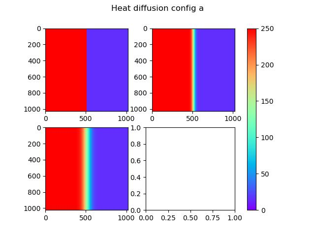
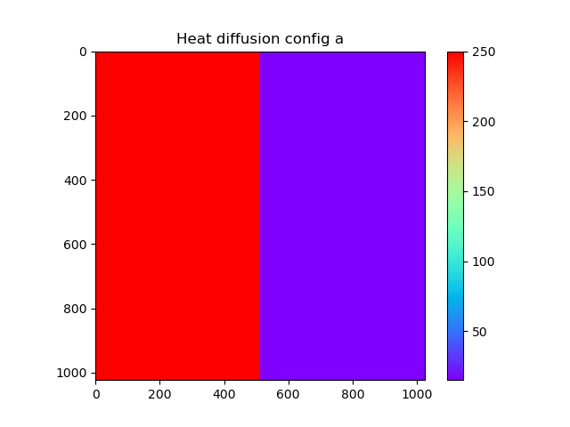
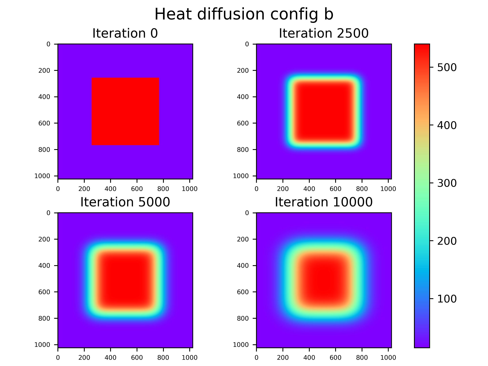

# Heat diffusion simulation with openMP

The implemented code simulates 2D heat diffusion on a metal plate represented by a 1024x1024 grid, where each cell fo the grid has its own temperature. Heat diffusion simulation can be generally done through finite difference method (FDM), that is a numerical technique to approximate derivatives with difference equations. The idea is indeed to update every cell each time based on the temperature of the neighbouring  cells in the previous step, until reaching a a target (e.g. a maximum temperature change) or reaching a maximum number of iterations, which will be this case. 
The goal is to use the library OpenMP to understand the possible speed ups given by the parallelization of the computation based on the number of threads used and to see the evolution of the diffusion through across the iteration. 
There are two different configurations, for each configuration a different type of diffusion is simulated. It is possible in fact that heat propagates in different ways.
- **Config a**:  this configuration starts with half plate at 250°C and half plate at room temperature, which is considered to be 15°C. The diffusion model considered here is an isotropic one: the new value of each cell is the average of is the average of its neighbouring cells:
        𝑛𝑒𝑤_𝑐𝑒𝑙𝑙(𝑖,𝑗) = 0.25 ∗ (𝑐𝑒𝑙𝑙(𝑖,𝑗−1) + 𝑐𝑒𝑙𝑙(𝑖,𝑗+1) + 𝑐𝑒𝑙𝑙(𝑖−1,𝑗) + 𝑐𝑒𝑙𝑙(𝑖+1,𝑗))  
The edges of the plate are treated as an insulation between the plate and the rest of the enviroment, thus for the cells confining with the borders, the new cell temperature is computed considering for the missing cells (due to the end of the grid) the temperature of the cell itself but in the previous step.
- **Config b**: the second configuration has 25% of the plate at 540°C and the other 75% again at room temperature. The hot part is placed in the center of the grid. This time the diffusion model is anisotropic. It will be still an averaged but weighed depending on the axis on where are the neighbiuring cells by the coefficients 𝑤𝑥 ad 𝑤𝑦. The formula used is:
        𝑛𝑒𝑤_𝑐𝑒𝑙𝑙(𝑖,𝑗) = 𝑤𝑥 ∗ (𝑐𝑒𝑙𝑙(𝑖,𝑗−1) + 𝑐𝑒𝑙𝑙(𝑖,𝑗+1)) + 𝑤𝑦 ∗ (𝑐𝑒𝑙𝑙(𝑖−1,𝑗) + 𝑐𝑒𝑙𝑙(𝑖+1,𝑗))  
The edges are treaten in the same way of before.

## Usage
When launching the program Heat_diff, the arguments to be passed are a character 'a'  or 'b' to select the configurations and an optional number of iteration, that if omitted is 10000 by default. The program also retreive the number of thread to be used from the environment variable *OMP_NUM_THREADS*, thus it is necessary change it from outside.
From the folder, you may call the bash script that is inside the folder *launchers* to launch automatically the compilation and the run of the code with differnt threads and both the configurations.
Inside the folder *plot* a couple of scripts python are present, which uses the files inside the *data* folder. The script *print_time* will perform an analysis on the time data and plot the trend of the computation time w.r.t. the number of threads. *print_diff* instade will generate and save an immage of the diffusion taking 4 matrices printed during the file execution. Note that also a gif generation of the diffusion is possible. To do this one just need to uncomment some lines of code. 
Since the idea is that just one time the matrices must be printed in order to know the temperature diffusion status, those are printed just in the specific condition of having the number of iteration grater than 99999 (because to create a long and cool gif lots of iterations are needed) and a number of thread equal to 10.

## Code description
The code accepts one or two arguments. The first one must be the configuration letter, thus 'a' or 'b'. The second one is the number of iterations, that by default is set to 10000. Two matrices are allocated using malloc after a check of the arguments, on of them is initialized to zero. Based on the configuration letter, the program will call the inizialization function for the other matrix, between *init_matrix_a* and *init_matrix_b*, that will create the starting layout of the metal plate. After this, always based on the configration, another function is called: *run_diffusion_*() *, passing the two matrices as arguments together with the number of iterations set. This function is at the core of the program. It strarts retreiving the number of threads from the environment variable. It opens a file for writing the time values, and, if the number of iteration is higher than 99999 and the numer of thread is 10, it opens also a file where it will print the matrix status during iterations. This strange contraint is given because in order to create a gif (and thus the file to have a meaning) lots of matrices are needed, and in addition if the program is launched with a script we are interested in every measure of time but just once in printing the diffusion. 
After that the program will iterate for the times given by the number of iteration the update of the matrix, performed in the following way: each time, each new cell is computed using one of the two matrices and is written in the other, the following time their roles are inverted (new values will be written always in the "older matrix"). This is simply done by checking if the index of the iteration is odd or even and calling the function for computing the new value with the two matrices in one order or in the other. The function that computes the new value takes the two matrices and the indeces of the cell it has to compute the value.  
### Parallelization
Parallelization is performed inside each iteration, using the OpenMP directive *#pragma omp parallel for collapse(2)* (actually it is used also during the matrices initialization but that time is not measured, as will be clear in the following). This directive creates a number of threads equal to the one set in the env variable and menages the execution of the two nested for used to update every cell. This parallelization is called single instruction multiple data (SIMD), and exploits the hardware to execute at the same time the same operation but performed on different data. Each complete matrix update instead, i.e. each iteration, is sequential.

### Data analysis
At each iteration, the computation time of the matrix update is taken using the openmp function *omp_get_wtime();*. As mentioned before, also a file containing the matrices status is created when the contraints are met. From the graph showing the computational time with respect to the number of threads iot can be seen that 

From another script, a gif of the diffusion has been created together with a set of images showing the plate status in the firsts 10000 cycles are generated. 
It can be seen that in the first configuration the diffusion is quite slow, and, after 10000 iterations, the cells away from the center of the plate are left unchanged. After 100000 iterations instead, that is how far the the gif goes, even the edges of the plate are starting to have the effect of the diffusion, even if moderately.

The second configuration seems to diffuse significantly faster than the first one. This is due to a bigger contact surface between the two different temperatures. Since the diffusion coefficients on the horizontal axis are higher, consiquently also the heat exchange goes faster in that direction.

 
